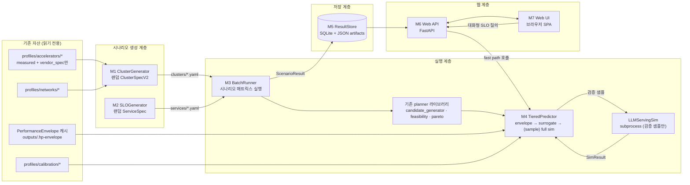
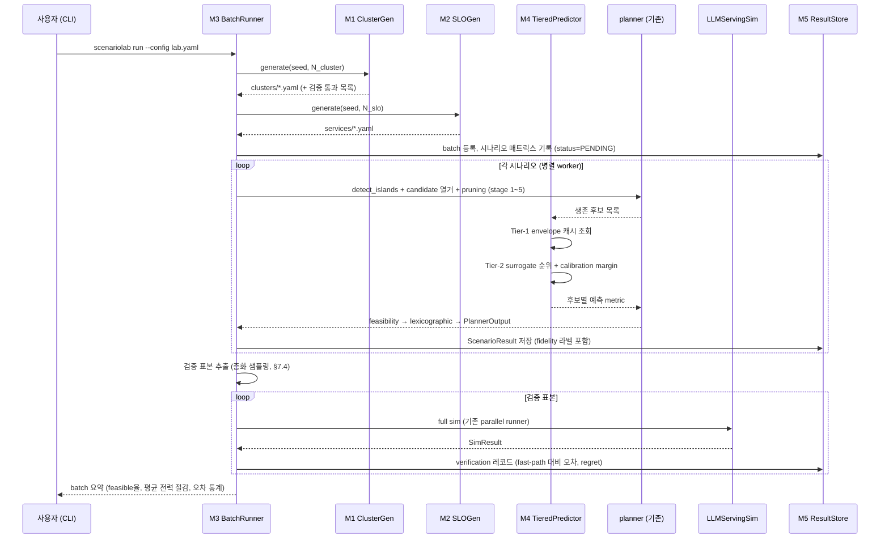
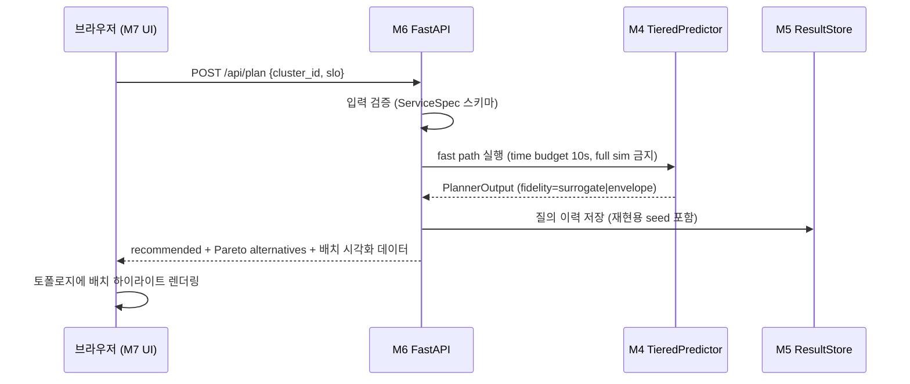
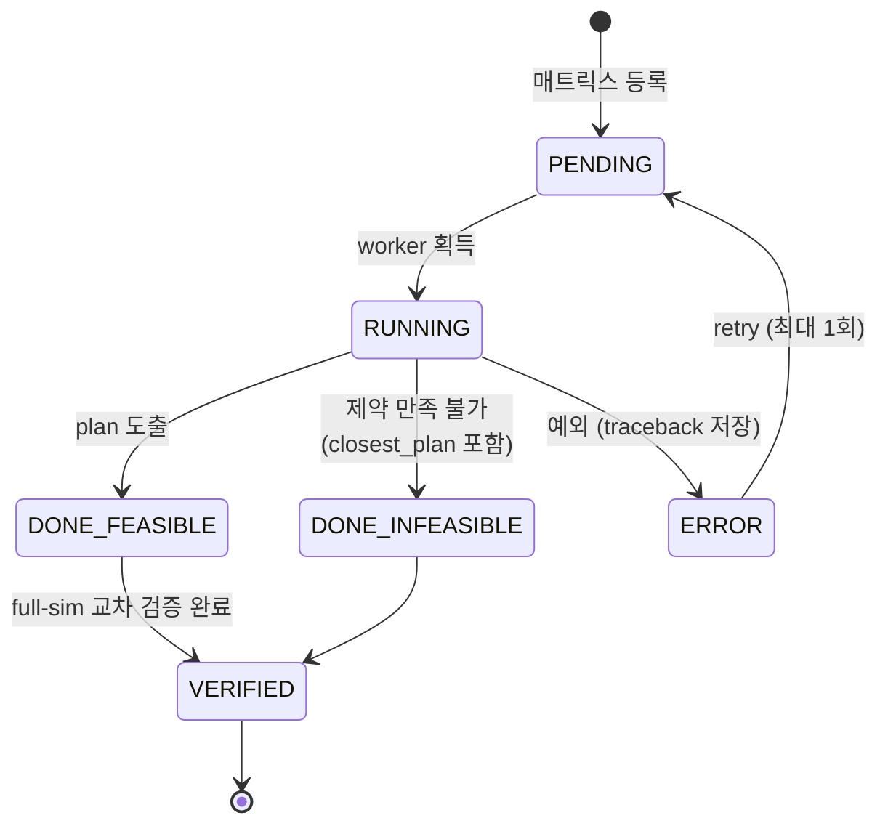
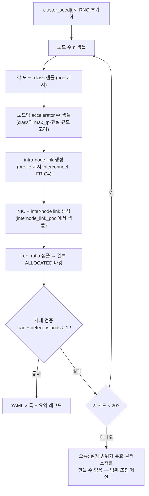
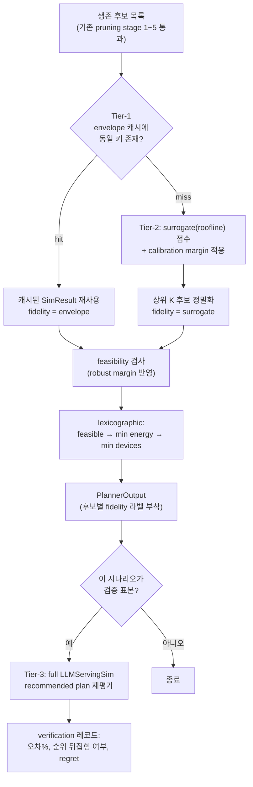
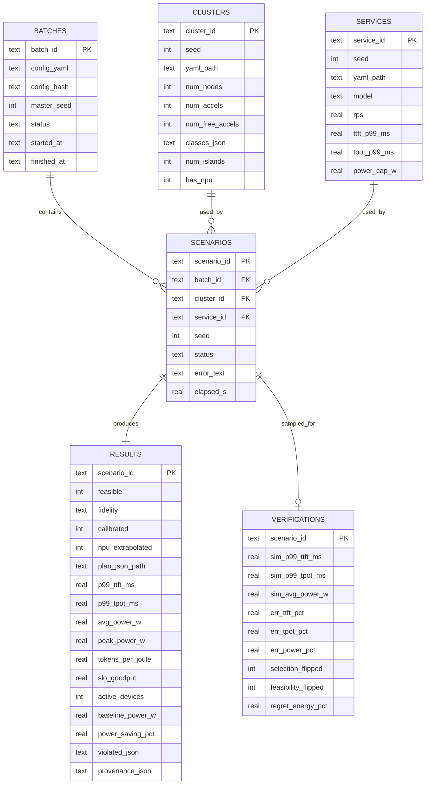
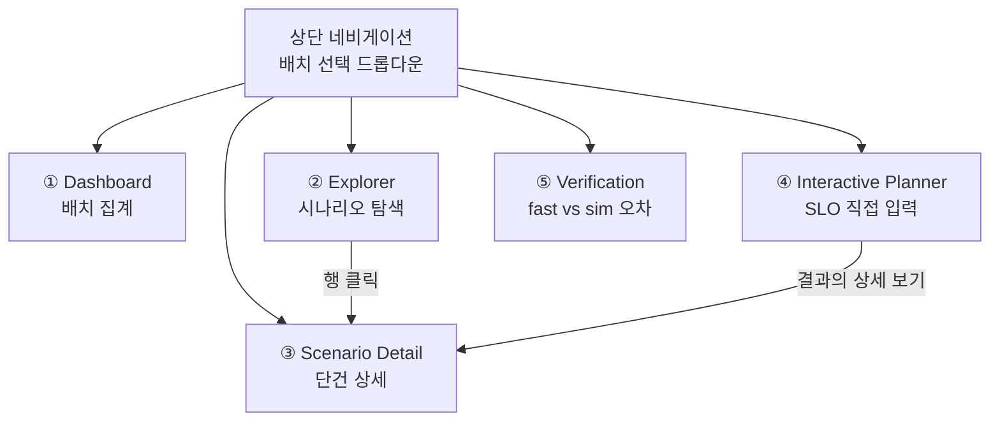

# ScenarioLab 설계서 — 랜덤 시나리오 기반 전력-최적 배치 실험 플랫폼

> 문서 버전: v1.0 (2026-09-01)
> 대상: Claude Code (구현 담당 AI 에이전트) 및 연구팀
> 기반 코드베이스: `swsok/heteropilot` (`main` = `0316c29`, upstream pin `2c2042ce`)
> 상위 문서: `WORK_ORDER_heteropilot.md` (v1.0) → `docs/deviations.md` → `CLAUDE.md`
> 이 설계서는 위 문서들의 **하위 문서**다. 충돌 시 상위 문서가 우선한다.

---

## 0. 개요

### 0.1 이 플랫폼이 하는 일

ScenarioLab은 HeteroPilot planner를 **대량 시나리오 실험 장치**로 확장한다.

1. **랜덤 클러스터 생성** — 실측/vendor_spec 프로파일 풀에서 다양한 이기종 GPU/NPU 클러스터 구성을 seed 기반으로 생성
2. **랜덤 SLO 생성** — TTFT/TPOT/power cap/트래픽을 무작위 샘플링한 ServiceSpec 다수 생성
3. **전력-최소 배치 도출** — 기존 실험 산출물(PerformanceEnvelope, surrogate, calibration)을 활용한 **계층형(tiered) 예측 경로**로 각 시나리오의 최적 배치를 빠르게 계산하고, 샘플링된 일부만 full LLMServingSim으로 교차 검증
4. **웹 시각화** — FastAPI 로컬 서버 + 브라우저 UI로 결과 탐색, 클러스터 토폴로지/배치 시각화, 대화형 SLO 질의 지원

### 0.2 사용자가 확정한 설계 결정

| 결정 항목 | 확정안 |
|---|---|
| 예측 경로 | **계층형**: envelope/surrogate 기본 + 샘플링 full-sim 교차 검증 |
| 웹 UI | **로컬 FastAPI 서버 + 대화형 UI** (정적 export는 후순위 확장) |
| HW 풀 | **measured + vendor_spec 프로파일만** (placeholder 배제 — 기존 절대규칙 유지) |
| 주 목적함수 | **전력 사용량 최소화** (SLO 제약 하 `minimize_energy`) |

### 0.3 기존 절대 규칙의 승계 (이 플랫폼에도 그대로 적용)

1. upstream 코드(`serving/`, `profiler/`, `bench/`, `configs/`) 수정 금지. 모든 신규 코드는 `scenariolab/` 아래.
2. backend 혼합 TP 금지 — planner의 기존 candidate 생성 로직을 그대로 사용하므로 자동 보장.
3. **수치의 provenance 라벨 유지**: 모든 결과에 fidelity 라벨(`sim` / `surrogate` / `envelope`)과 프로파일 source 라벨(`measured` / `vendor_spec`)을 부착하고 **UI까지 끝까지 전파**한다. placeholder 프로파일(`ascend_target`, `rbln_atom`)은 생성 풀에서 원천 배제.
4. 모든 결과 파일에 `planner/util/provenance.py` metadata 기록.
5. `planner/optimizer/exhaustive.py`는 검증 기준(oracle)으로 계속 사용 — 삭제 금지.
6. 재현성: master seed → 시나리오별 파생 seed. 동일 seed 재실행 시 byte-identical 결과.

### 0.4 알려진 한계의 명시적 취급

- **RNGD 카드 fixture의 동시성 낙관성** (HANDOVER §2.1): 시뮬레이터가 카드당 동시 76 시퀀스를 가정하나 실측 최대는 32 (~1.6× 낙관 가능성). RNGD가 포함된 시나리오 결과에는 UI에서 **불확실성 경고 뱃지**를 표시하고, calibration 파일의 bucket 범위 밖 외삽 여부를 결과에 기록한다.
- calibration은 bucket-scoped다 — bucket 밖 시나리오는 `calibrated: false`로 기록하고 margin 없이 raw 예측만 표시한다.

---

# 1. 전체 아키텍처

## 1.1 구성도



## 1.2 기존 코드와의 관계 (재사용 vs 신규)

| 계층 | 재사용 (수정 없음) | 신규 (`scenariolab/`) |
|---|---|---|
| 스키마 | `planner/spec.py`, `planner/inventory.py` | 생성기가 이 스키마의 **인스턴스를 생산** |
| 후보/최적화 | `candidate_generator.py`, `optimizer/{feasibility,pareto,exhaustive,surrogate}.py` | 호출만 |
| 예측 | `predictor/llmservingsim.py`, `envelope.py`, `calibration.py`, `util/parallel.py` | Tier 정책 wrapper |
| 재현성 | `util/provenance.py`, `util/percentile.py` | 호출만 |
| CLI | `python -m planner` (건드리지 않음) | `python -m scenariolab` 별도 진입점 |

**원칙: ScenarioLab은 planner를 라이브러리로 호출하는 소비자다.** planner 내부 로직을 복제하지 않는다. planner에 기능이 부족하면 planner 쪽에 별도 PR로 추가하고, 그 의존 변경을 해당 PR 설명과 부록 A 체크리스트에 기록한다.

## 1.3 디렉터리 구조

```text
heteropilot/
├── scenariolab/                      # [신규] 이 설계서의 구현 대상
│   ├── __init__.py
│   ├── __main__.py                   # CLI: generate / run / verify / serve / export
│   ├── config.py                     # LabConfig (마스터 설정 스키마, §3.1)
│   ├── generator/
│   │   ├── __init__.py
│   │   ├── cluster_gen.py            # M1 (§4)
│   │   ├── slo_gen.py                # M2 (§5)
│   │   └── sampling.py               # 공용 분포 샘플러 (seed 파생 규칙 포함)
│   ├── runner/
│   │   ├── __init__.py
│   │   ├── batch.py                  # M3 BatchRunner (§6)
│   │   └── tiers.py                  # M4 TieredPredictor (§7)
│   ├── store/
│   │   ├── __init__.py
│   │   ├── db.py                     # M5 SQLite 접근 계층 (§8)
│   │   ├── schema.sql                # DDL (§8.2)
│   │   └── export.py                 # 정적 리포트 export (후순위)
│   ├── api/
│   │   ├── __init__.py
│   │   ├── server.py                 # M6 FastAPI 앱 (§9)
│   │   └── schemas.py                # API 응답 Pydantic 모델
│   └── web/                          # M7 정적 SPA (§10) — 빌드 도구 없음
│       ├── index.html
│       ├── app.js
│       └── style.css
├── outputs/scenariolab/              # 실행 산출물 (git 미추적)
│   ├── clusters/                     #   생성된 ClusterSpecV2 YAML
│   ├── services/                     #   생성된 ServiceSpec YAML
│   ├── results/<batch_id>/           #   시나리오별 PlannerOutput JSON
│   └── lab.sqlite                    #   ResultStore DB
└── tests/scenariolab/
    ├── test_cluster_gen.py
    ├── test_slo_gen.py
    ├── test_batch.py
    ├── test_tiers.py
    ├── test_store.py
    ├── test_api.py
    └── golden/                       # golden 시나리오·응답 고정
```

---

# 2. 핵심 데이터 흐름

## 2.1 배치 실행 순서도



## 2.2 대화형 질의 순서도 (웹)



## 2.3 시나리오 상태 기계



- `ERROR`는 배치를 중단시키지 않는다 — 해당 시나리오만 격리하고 계속 진행.
- 배치는 **resumable**: 재실행 시 `PENDING`/`ERROR`만 다시 돈다 (DB가 진실 원천).

---

# 3. 마스터 설정 스키마

## 3.1 LabConfig (`scenariolab/config.py`)

배치 하나를 완전히 기술하는 단일 YAML. 모든 랜덤성은 여기의 `seed` 하나에서 파생된다.

```yaml
# experiments/configs/lab/default.yaml
lab:
  batch_name: lab-2026-09-01
  seed: 20260901                  # master seed — 모든 하위 seed의 유일한 근원

cluster_generator:                # → M1 (§4)
  num_clusters: 30
  nodes_per_cluster: {min: 1, max: 4}
  accelerators_per_node: {min: 1, max: 8}
  accelerator_pool:               # profiles/accelerators/ 중 measured|vendor_spec만
    - a40                         # measured
    - a5000                       # measured
    - rtxpro6000                  # vendor_spec
    - furiosa_rngd_card           # measured (카드 단위 모델)
  same_class_per_node: true       # 노드 내 단일 accelerator class (현실 반영)
  internode_link_pool: [ib_100g, ib_400g]   # profiles/networks/
  free_ratio: {min: 0.5, max: 1.0}          # FREE 상태 장치 비율

slo_generator:                    # → M2 (§5)
  num_specs: 50
  models:                         # 풀 내 모든 accelerator에 perf bundle이 있는 모델만
    - meta-llama/Llama-3.1-8B
  arrival_rate_rps: {dist: loguniform, min: 0.5, max: 30}
  input_tokens_p50: {dist: choice, values: [256, 512, 1024, 4096]}
  output_tokens_p50: {dist: choice, values: [64, 128, 512]}
  ttft_p99_ms: {dist: loguniform, min: 200, max: 5000}
  tpot_p99_ms: {dist: loguniform, min: 30, max: 300}
  power_cap_w: {dist: uniform, min: 400, max: 4000}
  min_tokens_per_joule: {dist: fixed, value: 0.0}   # 전력 최소화가 목적이므로 하한 미사용이 기본
  objective:
    primary: minimize_energy      # 고정 — 이 플랫폼의 목적
    secondary: minimize_active_accelerators

pairing:                          # 시나리오 매트릭스 구성 방식
  mode: cross                     # cross = num_clusters × num_specs 전체
                                  # random = 무작위 n쌍 (num_pairs 지정)
  max_scenarios: 1500             # 안전 상한 — 초과 시 실행 전 거부

runner:                           # → M3/M4 (§6, §7)
  workers: 16                     # fast-path 병렬도
  num_requests: 300               # 시나리오당 워크로드 크기 (planner와 동일 의미)
  tier_policy:
    envelope_cache: true          # Tier-1
    surrogate_top_k: 5            # Tier-2에서 상위 K만 정밀 평가
    full_sim: verification_only   # verification_only | top_k | never
  verification:
    fraction: 0.05                # 완료 시나리오의 5%를 full sim으로 교차 검증
    min_count: 10
    stratify_by: [feasible, cluster_size_bucket, has_npu]   # 층화 기준
    sim_workers: 32

store:
  db_path: outputs/scenariolab/lab.sqlite
  results_dir: outputs/scenariolab/results
```

검증 규칙:

- `accelerator_pool`의 각 항목은 로드 시점에 프로파일의 `source`를 확인, `placeholder`면 **즉시 오류로 거부** (경고가 아니라 거부).
- `models`의 각 모델은 pool 내 **모든** accelerator에 대해 perf bundle 존재를 확인. 없는 조합이 있으면 오류 메시지에 "어느 accelerator에 어느 모델 bundle이 없는지"를 명시.
- `num_clusters × num_specs > max_scenarios`(cross 모드)면 실행 전 거부하고 `pairing.mode: random` 전환을 제안.

## 3.2 Seed 파생 규칙 (`generator/sampling.py`)

```text
master_seed
 ├─ cluster_seed[i]  = H(master_seed, "cluster", i)     # i = 0..num_clusters-1
 ├─ slo_seed[j]      = H(master_seed, "slo", j)
 ├─ scenario_seed[i,j] = H(master_seed, "scenario", i, j)  # 워크로드 trace 생성용
 └─ verify_seed      = H(master_seed, "verify")            # 검증 표본 추출용
H = SHA-256 하위 8바이트 → uint64 (구현을 상수 모듈로 고정)
```

이 규칙 덕분에: (a) 시나리오 하나만 골라 단독 재실행 가능, (b) `num_clusters`를 늘려도 기존 i의 클러스터는 불변, (c) 재현성 테스트가 시나리오 단위로 가능.

---

# 4. M1 — ClusterGenerator (`scenariolab/generator/cluster_gen.py`)

## 4.1 목적

프로파일 풀에서 유효한(planner가 즉시 소비 가능한) 랜덤 `ClusterSpecV2` YAML을 생성한다.

## 4.2 기능 요구사항

| ID | 요구사항 |
|---|---|
| FR-C1 | `cluster_seed[i]`만으로 결정론적으로 클러스터 i를 생성한다 (동일 seed → byte-identical YAML) |
| FR-C2 | 노드 수, 노드당 accelerator 수, class, inter-node link를 설정 범위에서 샘플링한다 |
| FR-C3 | `same_class_per_node: true`면 노드 내 accelerator는 단일 class·단일 backend로 구성한다 |
| FR-C4 | intra-node link는 **프로파일이 지시하는 interconnect**로 생성한다 (예: rtxpro6000 → NVLINK, a40/a5000 → PCIE, rngd_card → 카드 내부이므로 링크 없음). 임의 조합 금지 |
| FR-C5 | `contention_group`을 규칙적으로 부여한다: 같은 노드의 PCIe link → `pcie-root-{node}`, NIC 공유 → `nic-{node}` |
| FR-C6 | `free_ratio` 샘플에 따라 일부 장치를 `state: ALLOCATED`로 표시해 "부분 점유 클러스터"를 표현한다. 단, FREE island가 하나도 없는 클러스터는 생성 시점에 폐기하고 재샘플링한다 (최대 20회, 초과 시 오류) |
| FR-C7 | 생성 직후 자체 검증: `load_cluster_spec()` 통과 + `detect_islands()` ≥ 1 island. 실패하면 그 클러스터는 폐기·재샘플링하고 폐기 사유를 로그에 남긴다 |
| FR-C8 | 각 링크·프로파일 수치는 profiles/의 값을 **복사 참조**만 한다. 생성기가 새로운 하드웨어 수치를 만들지 않는다 (절대규칙 3) |
| FR-C9 | 생성 YAML 헤더 주석에 `generated_by: scenariolab`, seed, LabConfig hash를 기록한다 |

## 4.3 입출력

```text
입력:  LabConfig.cluster_generator, cluster_seed[i], profiles/ (읽기 전용)
출력:  outputs/scenariolab/clusters/c{i:04d}.yaml   (ClusterSpecV2, 기존 스키마 그대로)
       + 생성 요약 레코드 {cluster_id, seed, num_nodes, num_accels, classes, islands, free_accels}
```

출력은 **기존 `planner/inventory.py` 스키마의 인스턴스**다. 새 스키마를 만들지 않는다.

## 4.4 생성 알고리즘



## 4.5 시험 방법 (`tests/scenariolab/test_cluster_gen.py`)

- **결정론**: 같은 seed로 2회 생성 → YAML byte-identical.
- **독립성**: `num_clusters` 10→20으로 늘려도 c0000~c0009는 불변 (seed 파생 규칙 검증).
- **유효성 전수**: 생성된 모든 클러스터가 `load_cluster_spec` + `detect_islands ≥ 1` 통과.
- **placeholder 거부**: pool에 `ascend_target`을 넣으면 LabConfig 로드 단계에서 오류.
- **FR-C4 회귀**: rtxpro6000 노드에 PCIE link가 생성되지 않음 / a40 노드에 NVLINK가 생성되지 않음.
- **경계**: nodes {min:1,max:1}, accels {min:1,max:1} 같은 최소 설정에서도 유효 클러스터 생성.
- **통계적 커버리지** (약검증): 클러스터 100개 생성 시 pool의 모든 class가 최소 1회 등장 (seed 고정으로 flaky하지 않게 golden화).

---

# 5. M2 — SLOGenerator (`scenariolab/generator/slo_gen.py`)

## 5.1 목적

설정된 분포에서 랜덤 `ServiceSpec` YAML을 생성한다. 목적함수는 항상 전력/에너지 최소화.

## 5.2 기능 요구사항

| ID | 요구사항 |
|---|---|
| FR-S1 | `slo_seed[j]`만으로 결정론적 생성 (byte-identical) |
| FR-S2 | 지원 분포: `uniform`, `loguniform`, `choice`, `fixed`. `sampling.py`의 공용 샘플러만 사용 |
| FR-S3 | 출력은 기존 `planner/spec.py` `ServiceSpec` 스키마의 유효 인스턴스여야 하며, 생성 직후 `load_service_spec()` 자체 검증 통과 |
| FR-S4 | token 분포의 내부 일관성 보장: p50 ≤ p95 ≤ p99 (p95/p99는 p50에 설정된 배수 규칙으로 유도, 기본 ×4/×8) |
| FR-S5 | `objective.primary`는 LabConfig 값(기본 `minimize_energy`)으로 고정. 시나리오별 변경 금지 (실험 통제 변수) |
| FR-S6 | **의도적으로 infeasible한 SLO도 생성 허용** — 걸러내지 않는다. infeasible 진단(closest_plan, violated_constraints)이 이 플랫폼의 관찰 대상 중 하나다 |
| FR-S7 | 생성 YAML 헤더 주석에 seed와 샘플된 값의 요약을 기록 |

## 5.3 입출력

```text
입력:  LabConfig.slo_generator, slo_seed[j]
출력:  outputs/scenariolab/services/s{j:04d}.yaml   (ServiceSpec, 기존 스키마 그대로)
       + 요약 레코드 {service_id, seed, model, rps, ttft_ms, tpot_ms, power_cap_w, ...}
```

## 5.4 시험 방법 (`test_slo_gen.py`)

- 결정론·독립성 (M1과 동일 패턴).
- 전수 유효성: 생성된 모든 spec이 `load_service_spec` 통과.
- FR-S4: p50 ≤ p95 ≤ p99 전수 확인.
- 분포 범위: 샘플 1,000개에서 각 필드가 설정 min/max 안에 있고, loguniform 필드의 log-스케일 히스토그램이 대략 균등 (seed 고정 golden).
- FR-S5: objective가 모든 생성물에서 동일.

---

# 6. M3 — BatchRunner (`scenariolab/runner/batch.py`)

## 6.1 목적

시나리오 매트릭스(클러스터 × SLO)를 등록하고, 병렬 worker로 planner를 호출해 결과를 DB에 적재하며, 중단 시 이어서 실행 가능하게 한다.

## 6.2 기능 요구사항

| ID | 요구사항 |
|---|---|
| FR-B1 | `pairing.mode`에 따라 매트릭스 구성 (cross 또는 random n쌍). `max_scenarios` 초과 시 실행 전 거부 |
| FR-B2 | 시나리오 실행 단위는 **순수 함수**: (cluster_yaml, service_yaml, scenario_seed, tier_policy) → ScenarioResult. 전역 상태 공유 금지 |
| FR-B3 | `workers` 수만큼 프로세스 병렬 실행. 결과 적재 순서와 무관하게 최종 DB 내용은 결정론적 |
| FR-B4 | **Resumable**: 시작 시 DB에서 PENDING/ERROR 시나리오만 골라 실행. DONE은 건드리지 않음 |
| FR-B5 | 시나리오 실패(예외)는 ERROR로 기록하고 배치를 계속 진행. 동일 시나리오 자동 재시도 1회 |
| FR-B6 | 각 ScenarioResult에 provenance(§0.3-4) + fidelity 라벨 + 소요 시간 기록 |
| FR-B7 | 전력 절감 지표 계산: `power_saving_pct = 1 − (recommended.avg_power / naive_baseline.avg_power)`. naive baseline은 **"SLO를 만족하는 후보 중 fastest-accelerator-only + 최대 TP"** 정책 (기존 Exp 기준과 동일 계열). baseline이 infeasible이면 NULL + 사유 기록 |
| FR-B8 | 검증 표본 추출(§7.4)과 full-sim 실행, verification 레코드 적재까지 담당 |
| FR-B9 | 진행 상황을 stdout(요약 라인)과 DB(batch 테이블)에 동시 기록 — 웹 UI가 폴링으로 진행률 표시 가능 |

## 6.3 입출력

```text
입력:  LabConfig, 생성된 clusters/·services/ YAML, ResultStore
출력:  DB 레코드 (scenarios, results, verifications, batches)
       outputs/scenariolab/results/<batch_id>/sc{i:04d}x{j:04d}.json  (PlannerOutput 원문)
stdout: [batch lab-2026-09-01] 1234/1500 done · feasible 61% · median power saving 23% · ETA 14m
```

## 6.4 CLI

```bash
python -m scenariolab generate --config experiments/configs/lab/default.yaml   # M1+M2만
python -m scenariolab run      --config experiments/configs/lab/default.yaml   # 전체 (resume 겸용)
python -m scenariolab verify   --batch lab-2026-09-01 --fraction 0.10          # 검증만 추가 실행
python -m scenariolab serve    --db outputs/scenariolab/lab.sqlite --port 8080  # 웹 서버
python -m scenariolab export   --batch lab-2026-09-01 --out report.html         # 정적 export (후순위)
```

## 6.5 시험 방법 (`test_batch.py`)

- **미니 배치 E2E**: 클러스터 2 × SLO 3, mock predictor(테스트 전용 `Predictor` 구현)로 30초 내 완주. DB에 6 시나리오 + 상태 전이 확인.
- **Resume**: 3개 완료 후 강제 중단 → 재실행 → 나머지 3개만 실행됨 (DONE 시나리오의 result 타임스탬프 불변).
- **오류 격리**: 특정 시나리오에서 예외를 던지는 mock → 해당 건만 ERROR, 나머지 DONE, 프로세스 exit code 0 + 요약에 오류 수 표기.
- **결정론**: workers=1과 workers=8의 최종 DB 내용(타임스탬프 제외) 동일.
- **FR-B7**: baseline이 feasible/infeasible한 두 fixture에서 power_saving_pct 값·NULL 처리 검증.

---

# 7. M4 — TieredPredictor (`scenariolab/runner/tiers.py`)

## 7.1 목적

기존 실험 산출물을 최대한 재사용해 시나리오당 예측 비용을 초 단위로 낮추고, full sim은 검증 표본에만 사용한다. **기존 planner의 pruning(건전 하한)과 feasibility는 그대로 두고, "후보별 metric을 어느 fidelity로 얻는가"만 계층화한다.**

## 7.2 계층 구조



## 7.3 기능 요구사항

| ID | 요구사항 |
|---|---|
| FR-T1 | Tier-1: 기존 `planner/envelope.py` 캐시를 키 그대로 조회 (키에 dp_replicas 포함 — deviations D13 준수). hit면 그 SimResult를 사용하고 fidelity=`envelope` |
| FR-T2 | Tier-2: 기존 `optimizer/surrogate.py` roofline ranker 재사용. calibration 파일이 해당 (hardware, workload bucket)을 커버하면 robust margin 적용(`calibrated: true`), 아니면 raw + `calibrated: false` 기록 |
| FR-T3 | **surrogate는 건전 하한이 아님을 결과에 명시** (PROJECT_REPORT §4.7). recommended가 surrogate 기반이면 `fidelity: surrogate` 라벨이 PlannerOutput → DB → UI까지 전파 |
| FR-T4 | Tier-3(full sim)은 `tier_policy.full_sim` 설정에 따름: `verification_only`(기본) / `top_k`(각 시나리오의 상위 K만 sim) / `never` |
| FR-T5 | 대화형(API) 경로에서는 time budget(기본 10초)을 강제 — Tier-3 금지, 후보 수가 많으면 surrogate K를 자동 축소하고 응답에 `truncated: true` 표시 |
| FR-T6 | RNGD 카드가 recommended plan에 포함되면 `npu_concurrency_extrapolated` 플래그 계산: plan의 카드당 동시 시퀀스 추정치가 실측 최대(32)를 넘으면 true (HANDOVER §2.1의 낙관성 경고를 데이터로 전파) |
| FR-T7 | full sim 실행은 기존 `predictor/llmservingsim.py` + `util/parallel.py`를 그대로 사용 (`--run-id` 격리 포함) |

## 7.4 검증 표본 추출 (FR-B8과 연동)

- `verify_seed` 기반 **층화 샘플링**: `stratify_by` 축(기본: feasible 여부 × 클러스터 크기 bucket × NPU 포함 여부)별로 균등하게 `fraction`(기본 5%, 최소 `min_count`건) 추출.
- 검증 내용: recommended plan을 full sim으로 재평가하고 다음을 기록 —
  - 후보 metric 오차: `(sim − fast) / sim` (TTFT p99, TPOT p99, avg power, tokens/J)
  - **선택 뒤집힘**: full sim 기준으로 재정렬했을 때 recommended가 바뀌는가 (regret = sim 기준 최적 대비 energy 차이)
  - feasibility 뒤집힘: fast는 feasible인데 sim은 violation (또는 반대)
- 이 통계가 UI의 "Verification" 페이지와 배치 요약의 신뢰도 지표가 된다.

## 7.5 시험 방법 (`test_tiers.py`)

- **Tier-1 hit 경로**: envelope 캐시에 심어둔 fixture 키 → sim 호출 0회, fidelity=envelope.
- **Tier-2 경로**: 캐시 miss → surrogate 호출, calibration 커버/비커버 두 fixture에서 `calibrated` 플래그 정확성.
- **FR-T5**: 인위적으로 큰 후보 목록 + 짧은 budget → truncated=true, 응답 시간 상한 준수 (mock으로 시간 제어).
- **FR-T6**: 동시 시퀀스 76을 유도하는 fixture → 플래그 true; 16이면 false.
- **오라클 정합 (핵심 회귀)**: 작은 fixture 클러스터에서 `full_sim: top_k(K=전체)` 결과와 기존 `plan --oracle` 결과의 recommended가 일치. **tiered 경로가 기존 planner와 다른 답을 내면 버그다** (fidelity가 낮아 다른 답이 나올 수 있는 surrogate 경로는 이 테스트에서 제외하고 Tier-3 경로만 검증).
- **결정론**: 동일 시나리오 2회 실행 → PlannerOutput byte-identical.

---

# 8. M5 — ResultStore (`scenariolab/store/`)

## 8.1 목적

배치·시나리오·결과·검증을 단일 SQLite 파일에 적재한다. DB 서버 금지(파일 기반), 원문 PlannerOutput JSON은 파일로 두고 DB에는 경로+요약 컬럼만.

## 8.2 스키마 (ER)



## 8.3 기능 요구사항·시험

- FR-D1: 모든 쓰기는 `store/db.py`의 단일 API를 거친다 (raw SQL 사용처 분산 금지). WAL 모드로 병렬 worker의 동시 기록 안전성 확보.
- FR-D2: `schema.sql`에 버전 번호를 두고, 로드 시 불일치면 명확한 마이그레이션 오류.
- FR-D3: 조회 API는 UI 필터 축(feasible, fidelity, has_npu, cluster 크기, power_saving 범위, 정렬)을 SQL 수준에서 지원 + 페이지네이션.
- 시험(`test_store.py`): 삽입-조회 왕복 무손실, 병렬 16-worker 동시 삽입 무유실, 필터/정렬/페이지네이션 정확성, 스키마 버전 불일치 오류.

---

# 9. M6 — Web API (`scenariolab/api/server.py`)

## 9.1 목적

ResultStore를 읽기 전용으로 서빙하고, 대화형 SLO 질의를 fast path로 처리하는 로컬 FastAPI 서버. 연구실 내부 도구이므로 인증 없음, 기본 바인딩 `127.0.0.1`(외부 노출 시 `--host` 명시 필요).

## 9.2 Endpoint 명세

| Method | Path | 설명 | 주요 파라미터 / 본문 |
|---|---|---|---|
| GET | `/api/summary` | 배치 목록 + 배치별 집계 (시나리오 수, feasible율, 전력 절감 중앙값, 검증 오차 요약, 진행률) | `?batch_id=` |
| GET | `/api/scenarios` | 시나리오 목록 (필터·정렬·페이지네이션) | `feasible, fidelity, has_npu, min_saving, cluster_id, service_id, sort, page, page_size` |
| GET | `/api/scenarios/{id}` | 단건 상세: PlannerOutput 원문 + 클러스터 그래프(노드·링크·배치 하이라이트용) + Pareto 대안 + 검증 레코드(있으면) | |
| GET | `/api/clusters` / `/api/clusters/{id}` | 생성된 클러스터 목록/상세 (토폴로지 그래프 JSON 포함) | |
| GET | `/api/services` / `/api/services/{id}` | 생성된 SLO 목록/상세 | |
| GET | `/api/verification` | fast-path vs full-sim 오차 산점도 데이터, 층별 통계, selection_flipped 목록 | `?batch_id=` |
| POST | `/api/plan` | **대화형 질의**: 기존 클러스터 + 사용자 입력 SLO → fast path 결과 | body: `{cluster_id, slo: {rps, input_p50, output_p50, ttft_p99_ms, tpot_p99_ms, power_cap_w}}` |
| GET | `/api/batches/{id}/progress` | 실행 중 배치 진행률 (UI 폴링용, 5초 간격 권장) | |
| GET | `/` 및 정적 경로 | `scenariolab/web/` SPA 서빙 | |

## 9.3 기능 요구사항

| ID | 요구사항 |
|---|---|
| FR-A1 | 모든 응답은 `api/schemas.py`의 Pydantic 모델로 정의 (OpenAPI 자동 문서 `/docs` 활성) |
| FR-A2 | `/api/plan`은 §7.3 FR-T5의 time budget을 강제하고, 응답에 `fidelity`, `calibrated`, `npu_extrapolated`, `truncated`, `elapsed_s`를 항상 포함 |
| FR-A3 | `/api/plan` 입력은 `load_service_spec`과 동일한 검증을 거친다. traffic 없는 요청은 400 + "SLO만으로는 자원 크기를 결정할 수 없음" |
| FR-A4 | infeasible 결과도 200으로 응답하되 `feasible: false` + closest_plan + violated_constraints + suggestions 포함 (진단은 오류가 아니다) |
| FR-A5 | 클러스터 그래프 JSON은 UI가 그대로 그릴 수 있는 형태: `{nodes: [{id, node, class, state, role?}], links: [{src, dst, type, bandwidth_gbps, in_plan}]}` — `role`/`in_plan`은 특정 plan을 겹쳐 볼 때만 채움 |
| FR-A6 | DB 파일은 읽기 전용으로 열고(`mode=ro`), `/api/plan` 질의 이력만 별도 테이블에 기록 |

## 9.4 시험 방법 (`test_api.py`)

- FastAPI `TestClient` + 소형 fixture DB로 전 endpoint 왕복.
- 필터·정렬·페이지네이션의 SQL-응답 일치 (test_store와 교차).
- `/api/plan`: 유효 입력 → 200 + 필수 필드; traffic 누락 → 400; 존재하지 않는 cluster_id → 404; infeasible SLO → 200 + 진단 (FR-A4).
- OpenAPI 스키마 스냅샷을 golden으로 고정 — endpoint 계약 회귀 감지.
- 시간 예산: mock TieredPredictor로 15초 지연 유도 → truncated 응답 확인.

---

# 10. M7 — Web UI (`scenariolab/web/`)

## 10.1 기술 선택과 이유

- **빌드 도구 없는 정적 SPA** (vanilla JS + ECharts CDN + 순수 CSS). 이유: 연구실 노드에는 Node 툴체인이 없고, 이 저장소의 규율상 재현이 단순해야 하며, FastAPI가 정적 파일을 그대로 서빙하면 배포 절차가 없다.
- 그래프(토폴로지) 렌더링: ECharts `graph` 시리즈 (force/circular layout). 차트: ECharts 산점도·막대·박스플롯.
- 다크/라이트는 후순위. 우선 라이트 고정.

## 10.2 화면 구조



### ① Dashboard — 배치 한눈에

```text
+----------------------------------------------------------------------+
| batch: lab-2026-09-01 ▼          1,500 scenarios · 61% feasible      |
+---------------+---------------+----------------+---------------------+
| Feasible율    | 전력 절감(중앙)| 검증 오차(P95) | NPU 경고 시나리오   |
|   61%         |   23%          |  ±7.8%        |   114건             |
+---------------+---------------+----------------+---------------------+
| [차트A] power_cap vs feasible율 곡선                                  |
| [차트B] 전력 절감 분포 히스토그램 (fidelity별 색)                     |
| [차트C] 클러스터 크기 × SLO 엄격도 히트맵 (feasible율)                |
+----------------------------------------------------------------------+
```

### ② Explorer — 필터 + 산점도 + 테이블

```text
+--- 필터 사이드바 ---+------------------------------------------------+
| feasible  [v]      | [산점도] X: p99 TTFT 예측  Y: avg power        |
| fidelity  [v]      |          색: feasible/infeasible                |
| has_npu   [v]      |          모양: fidelity  크기: active devices  |
| saving ≥ [__]%     |   → SLO 사각형(입력 상한) 오버레이              |
| cluster class [v]  +------------------------------------------------+
| 정렬: power ▲      | [테이블] scenario · cluster · SLO 요약 ·        |
|                    |  feasible · avg_power · saving% · fidelity 뱃지 |
+--------------------+------------------------------------------------+
```

### ③ Scenario Detail — 이 플랫폼의 핵심 화면

```text
+------------------------------+---------------------------------------+
| [토폴로지 그래프]            | 요약 카드                              |
|  노드=accelerator            |  feasible ✓ · fidelity: envelope       |
|  색=class, 회색=ALLOCATED    |  p99 TTFT 412ms (SLO 500)              |
|  굵은 테두리=선택된 배치     |  avg power 812W (cap 1500) · save 27%  |
|  링크 굵기=bandwidth,        |  ⚠ NPU 동시성 외삽 (>32/card)          |
|  파란색=plan이 쓰는 경로     +---------------------------------------+
|                              | [Pareto 차트] energy vs TTFT           |
|  (role 라벨: P=prefill,      |  ● recommended  ○ alternatives         |
|   D=decode, A=aggregated)    +---------------------------------------+
|                              | [전력 분해 막대] instance별 avg W       |
+------------------------------+---------------------------------------+
| infeasible이면: violated_constraints 표 + closest_plan + suggestions |
| 하단: plan YAML 원문 접기/펼치기 · provenance 접기/펼치기             |
+----------------------------------------------------------------------+
```

### ④ Interactive Planner

```text
+---------------------------+------------------------------------------+
| 클러스터 선택 [c0007 ▼]   |  (제출 후) ③과 동일한 상세 뷰 렌더링      |
| (미니 토폴로지 미리보기)  |  + "이 결과는 surrogate 예측이며           |
| rps        [15    ]       |     full sim 검증을 거치지 않았습니다"     |
| input p50  [512   ]       |     라는 fidelity 고지 문구 상시 표시      |
| output p50 [128   ]       |                                          |
| TTFT p99   [500   ] ms    |                                          |
| TPOT p99   [40    ] ms    |                                          |
| power cap  [1500  ] W     |                                          |
| [ 최적 배치 계산 ]        |                                          |
+---------------------------+------------------------------------------+
```

### ⑤ Verification

```text
+----------------------------------------------------------------------+
| [산점도] X: fast 예측 avg power, Y: full-sim avg power (y=x 기준선)   |
| [산점도] TTFT 동일 · [표] 층별 오차 통계 (P50/P95)                    |
| [목록] selection_flipped=true 시나리오 — 클릭 시 ③으로               |
+----------------------------------------------------------------------+
```

## 10.3 기능 요구사항

| ID | 요구사항 |
|---|---|
| FR-U1 | **fidelity·경고 뱃지는 모든 수치 옆에 상시 표시** — `envelope`(초록)/`surrogate`(노랑)/`sim`(파랑), `⚠ NPU 외삽`, `calibrated: false`. 숨김 불가 (프로젝트 정직성 규율의 UI 구현) |
| FR-U2 | Explorer 산점도에 현재 필터의 SLO 상한 사각형을 오버레이 (논문 Figure 3 "feasible region"의 대화형 판) |
| FR-U3 | 토폴로지 그래프에서 plan이 사용하는 장치·링크를 시각적으로 구분 (테두리·색), prefill/decode role 라벨 표시 |
| FR-U4 | 모든 화면은 URL 쿼리에 상태를 반영 (`#/scenario/sc0007x0031`) — 링크 공유로 특정 시나리오 재방문 가능 |
| FR-U5 | 서버 부재/오류 시 명확한 오류 배너 (빈 화면 금지) |
| FR-U6 | 1,500 시나리오 테이블에서 페이지네이션으로 응답성 유지 (서버측 페이지네이션 사용, 전체 로드 금지) |

## 10.4 시험 방법

- **API 계약 기반**: UI는 golden OpenAPI 스키마에만 의존 — test_api의 스키마 스냅샷이 UI 회귀의 1차 방어선.
- **수동 smoke 체크리스트** (`docs/scenariolab_ui_checklist.md`로 커밋): 5개 화면 각각 렌더·필터·클릭 경로 확인 항목 명시.
- (선택, 후순위) Playwright headless smoke: `serve` 띄우고 fixture DB로 5개 화면 로드 + 콘솔 에러 0 확인. CI 부담이 크면 로컬 전용 스크립트로 유지.

---

# 11. 시험 전략 총괄


| 계층 | 실행 환경 | 통과 기준 |
|---|---|---|
| 단위 | 어느 노드나 (sim 불필요, mock) | `pytest tests/scenariolab` 전건 통과 |
| 통합 E2E | 어느 노드나 | 미니 배치 30초 내 완주, 상태 전이·resume·오류 격리 정상 |
| Golden | 어느 노드나 | seed 고정 배치의 DB 덤프(타임스탬프 제외)가 golden과 일치 |
| 오라클 정합 | ASTRA-Sim 빌드된 노드 | tiered full-sim 경로의 recommended == 기존 `plan --oracle` |
| 실검증 | ASTRA-Sim 빌드된 노드 | 소형 배치 fraction=1.0에서 검증 리포트 생성, 오차 통계가 §7.4 정의대로 산출 |

품질 게이트는 기존과 동일: `pytest` + `ruff check .` + `mypy scenariolab/` (planner와 동일하게 scenariolab만 type-clean 요구).

---

# 12. 구현 단계와 완료 조건

기존 규율 유지: 한 기능 = 한 branch = 한 PR.

## P1 — 생성기 + 실행기 (branch: `feat/scenariolab-core`)

구현: `config.py`, `sampling.py`, M1, M2, M3(mock predictor로), M5 스키마, CLI `generate`/`run`.

완료 조건:

```bash
python -m scenariolab run --config experiments/configs/lab/smoke.yaml
# smoke.yaml = 클러스터 3 × SLO 5, tier_policy.full_sim: never
```

가 완주하고 DB에 15개 시나리오 + 결과가 적재되며, 단위·통합·golden 테스트 통과.

## P2 — 계층형 예측 + 검증 (branch: `feat/scenariolab-tiers`)

구현: M4 전체(envelope/surrogate/calibration 연동, FR-T6 NPU 플래그), 검증 표본 추출 + full-sim 실행, CLI `verify`.

완료 조건: 오라클 정합 테스트 통과 + 실환경 소형 배치에서 verification 레코드와 오차 통계 산출.

## P3 — Web API + UI (branch: `feat/scenariolab-web`)

구현: M6 전체, M7 화면 ①②③, CLI `serve`.

완료 조건: fixture DB로 `test_api` 통과, 수동 smoke 체크리스트 ①②③ 확인.

## P4 — 대화형 질의 + Verification 화면 (branch: `feat/scenariolab-interactive`)

구현: `/api/plan` + 화면 ④⑤, 질의 이력 저장.

완료 조건: 대화형 질의가 10초 budget 내 응답(FR-T5), 화면 ④⑤ 체크리스트 확인, infeasible 진단 UI 노출(FR-A4).

## P5 — (후순위) 정적 export, 다크 테마, Playwright smoke

---

# 13. 성능 목표

| 항목 | 목표 | 근거 |
|---|---|---|
| fast-path 시나리오 처리량 | ≥ 10 시나리오/분 (workers=16, sim 미사용 시) | envelope/surrogate는 초 단위 — 병목은 candidate 열거 |
| 1,500 시나리오 배치 (검증 5% 포함) | 수 시간 내 (검증 75건 × full sim이 지배) | 기존 실측: 78후보 full sim ≈ 8분 @ 32-way |
| `/api/plan` 응답 | ≤ 10초 (budget 강제) | FR-T5 |
| 조회 API | ≤ 200ms (1,500건 DB, 페이지네이션) | SQLite + 인덱스로 충분 |
| UI 첫 로드 | ≤ 2초 (로컬) | CDN 라이브러리 1종 + 정적 파일 |

성능 미달 시 우선순위: (1) envelope 캐시 적중률 개선(키 정규화), (2) candidate 열거 결과의 클러스터 단위 memoization (동일 cluster_id에 SLO만 다른 시나리오는 후보 집합 공유 — cross 모드에서 num_specs배 절감).

---

# 14. 위험과 대응

| 위험 | 영향 | 대응 (설계에 반영된 위치) |
|---|---|---|
| surrogate가 최적을 놓침 (건전 하한 아님) | 잘못된 "최적 배치" 결론 | 검증 표본의 selection_flipped/regret 상시 측정 (§7.4), UI Verification 화면 (§10), fidelity 뱃지 상시 노출 (FR-U1) |
| RNGD 카드 동시성 낙관 (~1.6×) | NPU 포함 시나리오의 전력/goodput 과대평가 | FR-T6 플래그 + UI 경고 뱃지. envelope 재측정(HANDOVER §2.1) 완료 시 calibration 갱신만으로 반영 |
| calibration bucket 밖 외삽 | margin 없는 raw 예측 | `calibrated: false` 기록·표시 (FR-T2), 대시보드에 비커버 비율 집계 |
| cross 매트릭스 폭발 | 실행 시간·디스크 | `max_scenarios` 상한 (FR-B1), random pairing 모드, 클러스터 단위 memoization (§13) |
| 랜덤 클러스터가 비현실적 토폴로지 생성 | 무의미한 결과 | FR-C4(프로파일 지시 interconnect만), FR-C3(노드 내 단일 class), 자체 검증 FR-C7 |
| 웹 서버의 계산 부하로 배치 간섭 | 배치 지연 | API는 DB 읽기 전용(FR-A6), `/api/plan`만 계산하며 budget 강제. 배치와 서버는 별도 프로세스 |
| DB 동시 기록 충돌 | 결과 유실 | WAL 모드 + 단일 접근 계층 (FR-D1), 병렬 삽입 테스트 (§8.3) |

---

# 15. 산출물 요약 (Definition of Done, 플랫폼 전체)

1. `python -m scenariolab run --config <lab.yaml>` 한 명령으로: 랜덤 클러스터 N × 랜덤 SLO M 생성 → 전 시나리오 전력-최소 배치 도출 → 검증 표본 full-sim 교차 검증 → SQLite 적재.
2. `python -m scenariolab serve`로 브라우저에서: 배치 집계, 시나리오 탐색·필터, 클러스터 토폴로지 위 배치 시각화, Pareto 대안, 대화형 SLO 질의, fast-vs-sim 오차 확인.
3. 모든 수치에 fidelity·calibration·NPU-외삽 라벨이 DB부터 UI까지 전파.
4. 동일 config + seed 재실행 시 byte-identical 결과 (검증 타임스탬프 제외).
5. `pytest tests/scenariolab` + `ruff` + `mypy scenariolab/` 통과, golden·오라클 정합 테스트 포함.

---

## 부록 A. 기존 문서와의 정합성 체크리스트 (구현 시작 전 확인)

- [ ] `docs/deviations.md` D10(메모리 모델 보수화)·D13(envelope 키)·D16(TP 제약) 확인 — 생성기·tier가 이 결정들을 따르는지
- [ ] `planner/envelope.py`의 실제 캐시 키 구조를 읽고 Tier-1 조회 코드 작성 (추측 금지)
- [ ] `optimizer/surrogate.py`의 입력 계약 확인 (roofline ranker가 요구하는 필드)
- [ ] `profiles/calibration/*.yaml`의 bucket 정의 형식 확인 후 FR-T2 커버 판정 구현
- [ ] LabConfig의 workload trace 생성이 planner의 `util/workload.py`와 동일 코드 경로인지 확인 (D19의 교훈: **arrival 패턴이 다르면 TTFT 비교가 무의미**)
- [ ] 실행 노드 확인: full-sim 검증은 ASTRA-Sim이 빌드된 노드에서만. 세션 시작 시 `bash scripts/whichnode.sh`

## 부록 B. 이 설계가 의도적으로 하지 않는 것

- 실제 배포(`planner deploy`) 연동 — 이 플랫폼은 시뮬레이션·예측 전용. 배포는 기존 Phase 4 CLI의 몫
- RL 기반 탐색, Kubernetes, live migration (상위 문서 범위 외 규칙 승계)
- placeholder 하드웨어(H100 등 가상 프로파일) — 사용자 결정으로 제외. 추후 포함하려면 `source: synthetic` 라벨 체계를 별도 설계할 것
- 다중 사용자·인증 — 로컬 연구 도구
