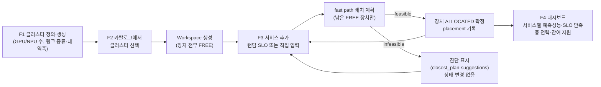
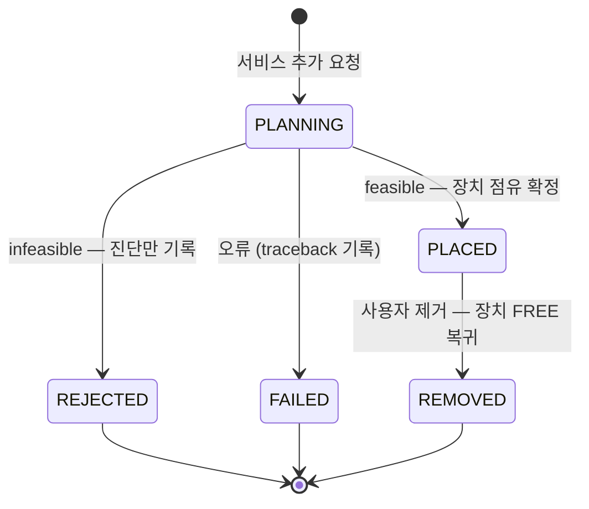
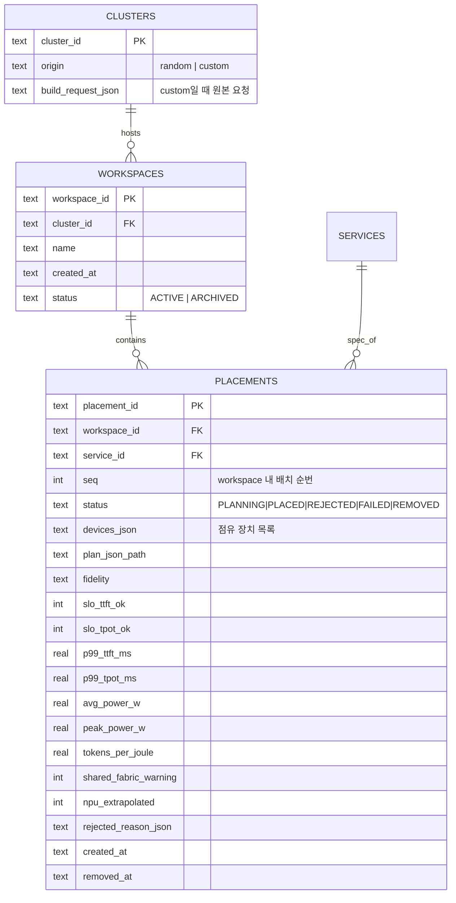

# ScenarioLab 작업지시서 — 대화형 워크스페이스 (사용자 정의 클러스터 + 다중 서비스 배치)

> 문서 버전: v1.0 (2026-09-02)
> 대상: Claude Code (구현 담당 AI 에이전트)
> 상위 문서: `DESIGN_scenariolab.md` (ScenarioLab 설계서 v1.0) → `WORK_ORDER_heteropilot.md` → `docs/deviations.md` → `CLAUDE.md`
> 전제: ScenarioLab 설계서의 M1~M7이 구현되어 있거나 최소한 P1(생성기+실행기)·P3(API+UI)이 완료된 상태에서 착수한다. 미완이면 이 작업지시서의 P0(§8)에 따라 선행 범위를 먼저 완성한다.

---

## 0. 요구 기능 요약

이 작업지시서는 ScenarioLab에 **대화형 워크스페이스(Workspace)** 모드를 추가한다. 사용자 요구 4가지:

| # | 기능 | 이 문서의 구현 단위 |
|---|---|---|
| 1 | 클러스터 규모를 사용자가 정의해 생성 (GPU/NPU 개수, 연결망 종류, 대역폭) | F1 ClusterBuilder (§3) |
| 2 | 생성된 클러스터 목록을 보고 선택 | F2 Cluster Catalog (§4) |
| 3 | 선택된 클러스터에 랜덤/사용자 지정 SLO의 LLM 서비스 여러 개를 배치·추가 | F3 Incremental Placement (§5) |
| 4 | 전체 LLM 서비스들의 예측 성능과 SLO 만족 여부 표시 | F4 Workspace Dashboard (§6) |

## 0.1 절대 규칙 (기존 규칙의 승계 + 이 기능의 추가 규칙)

1. 기존 절대 규칙 전부 승계: upstream 수정 금지, backend 혼합 TP 금지, placeholder 프로파일 배제, provenance/fidelity 라벨 UI까지 전파, seed 재현성.
2. **사용자 정의 대역폭은 하드웨어 실측이 아니다.** 사용자가 입력한 링크 대역폭·latency는 `source: user_defined`로 라벨하고, 프로파일 프리셋을 선택한 경우에만 해당 프로파일의 source(measured/vendor_spec)를 승계한다. UI·결과에 이 라벨을 그대로 표시한다.
3. **장치는 배타 점유한다.** 하나의 accelerator는 동시에 하나의 서비스에만 배정된다. 같은 장치에 두 서비스를 co-location하는 기능은 이 작업지시서 범위 밖이다 (시뮬레이터가 장치 공유를 모델링하지 않기 때문 — 근거 없는 예측을 만들지 않는다).
4. **서비스 간 간섭은 모델링하지 않음을 명시한다.** 각 서비스의 예측은 "해당 장치들을 단독 사용"하는 가정의 값이다. 두 서비스의 plan이 같은 `contention_group`(공유 NIC, PCIe root, inter-node fabric)을 지나면 결과에 `shared_fabric_warning`을 붙이고 UI에 경고 뱃지를 표시한다. 간섭을 반영한 수치를 만들어내지 않는다.
5. **이것은 multi-tenant 공동 최적화가 아니다.** 서비스는 도착 순서대로 남은 자원에서 개별 최적화(greedy sequential placement)된다. 전체 서비스 집합의 joint re-optimization, fairness, 서비스 간 자원 재배분은 상위 문서가 범위 외로 정한 multi-tenant 연구에 속하므로 구현하지 않는다. 단, "전체 재배치(replan-all)" 버튼 하나는 허용한다 — 이는 배치 순서를 바꿔 순차 배치를 다시 실행하는 것일 뿐, joint 최적화가 아니다 (§5.5).

---

# 1. 개념 모델과 전체 흐름

## 1.1 Workspace 개념

**Workspace** = (클러스터 1개) + (그 위에 순차 배치된 서비스 목록) + (장치 점유 상태 스냅샷).

- 배치 성공 시 해당 장치들은 workspace 안에서 `ALLOCATED(service_id)`로 전환되고, 다음 서비스는 남은 `FREE` 장치에서만 계획된다.
- 클러스터 원본 YAML은 불변이다. 점유 상태는 workspace가 소유한 **오버레이**로만 존재한다 (같은 클러스터로 여러 workspace를 독립적으로 만들 수 있다).
- 서비스 제거 시 그 장치들은 즉시 FREE로 돌아온다. 제거가 다른 서비스의 배치를 바꾸지 않는다 (각 배치는 확정 시점의 스냅샷).

## 1.2 전체 흐름



## 1.3 Placement 상태 기계



`REJECTED`/`FAILED`도 기록으로 남긴다(진단 이력이 실험 데이터다). workspace의 현재 점유 상태는 `PLACED` placement들의 합으로 항상 재계산 가능해야 한다 (DB가 진실 원천, 메모리 캐시는 파생물).

---

# 2. 데이터 모델 확장

## 2.1 ClusterBuildRequest (F1의 입력, `scenariolab/generator/cluster_builder.py`)

사용자 정의 클러스터를 기술하는 새 Pydantic 스키마. **출력은 기존 ClusterSpecV2 YAML**이며 새 클러스터 스키마를 만들지 않는다.

```yaml
name: my-hetero-16            # cluster_id에 반영 (custom- 접두 자동 부여)
nodes:
  - class: a40                # profiles/accelerators/ 프리셋 id (placeholder면 거부)
    count_per_node: 8         # 노드당 accelerator 수 (1 ≤ n ≤ 프로파일 상한)
    num_nodes: 2              # 이 구성의 노드 수
  - class: furiosa_rngd_card
    count_per_node: 4
    num_nodes: 1
interconnect:
  intra_node: auto            # 항상 auto — 프로파일이 지시하는 interconnect 강제 (FR-C4 승계)
  inter_node:
    preset: ib_100g           # profiles/networks/ 프리셋 id, 또는
    # custom:                 # 프리셋 대신 직접 입력 시
    #   type: ETHERNET        # NVLINK|PCIE|INFINIBAND|ETHERNET|HCCS 중 inter-node 허용 타입
    #   bandwidth_gbps: 50
    #   latency_ns: 8000
initial_state: FREE           # 모든 장치 FREE로 시작 (부분 점유는 F1 범위 외)
```

검증 규칙:

- `class`는 로드 시 프로파일 source 확인 — `placeholder`면 거부 (오류 메시지에 사용 가능 class 목록 포함).
- `preset`과 `custom`은 상호 배타. `custom` 사용 시 생성 YAML의 해당 링크에 `source: user_defined` 주석 기록.
- `custom.bandwidth_gbps`는 0 초과, 상한 없음 — 단 1600 Gbps 초과 시 "현존 fabric 범위를 벗어난 값" 경고를 결과에 기록 (거부는 하지 않음: sweep 실험용).
- 총 accelerator 수 상한 64 (fast path 응답성 보호. 초과 시 거부 + batch 모드 안내).
- 생성 직후 기존 자체 검증 승계: `load_cluster_spec` + `detect_islands ≥ 1`.

## 2.2 DB 테이블 추가 (`scenariolab/store/schema.sql` 확장)



- `clusters` 테이블에 `origin`(random | custom)과 `build_request_json` 컬럼 추가 (마이그레이션: 스키마 버전 +1, 기존 행은 origin=random).
- `services` 테이블은 그대로 재사용 — 사용자 지정 SLO도 ServiceSpec YAML로 저장해 service_id를 부여한다 (랜덤/지정의 구분은 `origin` 컬럼 추가로).
- SLO 만족 판정 컬럼(`slo_ttft_ok`, `slo_tpot_ok`)은 **robust 예측값 기준** (calibration margin 반영값). margin이 없으면(`calibrated: false`) raw 예측 기준으로 판정하되 그 사실을 라벨로 표시.

---

# 3. F1 — 사용자 정의 클러스터 생성 (ClusterBuilder)

## 3.1 구현 위치

- `scenariolab/generator/cluster_builder.py` — `build_cluster(req: ClusterBuildRequest) -> Path` (ClusterSpecV2 YAML 생성). 기존 `cluster_gen.py`의 링크 생성·contention_group 부여·자체 검증 헬퍼를 **공용 함수로 추출해 공유**한다 (복제 금지 — 추출 리팩터링은 같은 PR에서 수행).
- CLI: `python -m scenariolab build-cluster --spec my_cluster.yaml` (ClusterBuildRequest YAML 입력) 또는 주요 필드의 플래그 입력.
- API: `POST /api/clusters/build` (body = ClusterBuildRequest JSON) → 생성된 cluster 요약 반환.
- UI: 화면 ⑥ "Cluster Builder" 폼 (§6.2).

## 3.2 기능 요구사항

| ID | 요구사항 |
|---|---|
| FR-CB1 | ClusterBuildRequest(§2.1)의 모든 검증 규칙을 구현하고, 실패 시 필드 단위 오류 메시지를 반환한다 |
| FR-CB2 | intra-node 링크는 항상 프로파일 지시 interconnect로 생성 (사용자 선택 불가 — 하드웨어 사실이기 때문). inter-node만 프리셋/custom 선택 |
| FR-CB3 | 생성된 YAML 헤더에 `generated_by: scenariolab-builder`, 요청 원문 hash, 생성 시각 기록. DB `clusters`에 origin=custom으로 등록 |
| FR-CB4 | 동일 요청 재제출 시 동일 cluster_id로 멱등 처리 (요청 hash 기반) — 중복 행 생성 금지 |
| FR-CB5 | 생성 직후 `detect_islands` 결과(island 수, 각 island의 TP 후보)를 응답에 포함해 사용자가 즉시 확인 가능 |

## 3.3 시험 (`tests/scenariolab/test_cluster_builder.py`)

- 유효 요청 → YAML 생성 + `load_cluster_spec` + `detect_islands ≥ 1` 통과, GPU/NPU 개수·링크 대역폭이 요청과 일치.
- placeholder class 거부, preset+custom 동시 지정 거부, 65개 이상 거부.
- custom 대역폭 → 생성 링크에 `source: user_defined` 기록; preset → 프로파일 source 승계.
- 멱등성: 동일 요청 2회 → cluster 1행.
- intra-node 링크가 사용자 입력과 무관하게 프로파일 지시대로 생성됨 (rtxpro6000 → NVLINK 등).

---

# 4. F2 — 클러스터 카탈로그·선택

## 4.1 구현 내용

- API 확장: `GET /api/clusters`에 `origin`(random|custom|all), 정렬(생성일·장치 수), 페이지네이션 추가. 응답 행: cluster_id, origin, 노드 수, class별 장치 수(예: `a40×16, rngd_card×4`), island 수, 링크 요약(inter-node 종류·대역폭·source 라벨), 사용 중인 workspace 수.
- `POST /api/workspaces` (body: `{cluster_id, name}`) → workspace 생성, 모든 장치 FREE 오버레이로 시작.
- `GET /api/workspaces`, `GET /api/workspaces/{id}` — 목록·상세(점유 현황 포함).
- UI: 화면 ⑦ "Clusters" — 카탈로그 테이블 + 행 선택 → 미니 토폴로지 미리보기 → "이 클러스터로 Workspace 시작" 버튼.

## 4.2 기능 요구사항·시험

- FR-CAT1: 목록의 모든 수치·라벨은 DB에서만 읽는다 (YAML 재파싱 금지 — 응답성).
- FR-CAT2: 같은 클러스터로 복수 workspace 생성 허용, 서로 완전 독립 (테스트: workspace A의 배치가 B의 FREE 상태에 영향 없음).
- FR-CAT3: workspace 생성 시 클러스터 YAML의 현재 hash를 저장 — 이후 YAML이 바뀌면(재생성 등) workspace 상세에 "원본 변경됨" 경고 표시 (테스트 포함).

---

# 5. F3 — 다중 LLM 서비스 배치·추가 (Incremental Placement)

## 5.1 동작 정의 (핵심)

```text
입력: workspace_id + ServiceSpec (랜덤 생성 or 사용자 입력)
1. workspace의 현재 오버레이를 적용한 ClusterSpecV2 사본 생성
   (PLACED placement들이 점유한 장치를 state=ALLOCATED로 마킹)
2. 그 사본 위에서 기존 planner 파이프라인 실행 (fast path, time budget 10s)
   — 후보는 FREE 장치로만 구성됨 (기존 "state == FREE only" 규칙이 그대로 작동)
3. feasible → 사용자 확인(UI) 또는 --yes(CLI) 후 PLACED 확정, 장치 점유 기록
   infeasible → REJECTED 기록 + 진단 반환, 오버레이 불변
```

**설계 근거**: 기존 planner가 이미 `state == FREE only` 규칙으로 동작하므로(inspect-cluster 출력으로 확인됨), 다중 서비스 배치는 "오버레이 적용 → 기존 파이프라인 호출"로 환원된다. planner 내부 수정 없음.

## 5.2 서비스 SLO 입력 두 가지 경로

- **랜덤**: 기존 M2 SLOGenerator 재사용. `POST /api/workspaces/{id}/placements` body에 `{slo: "random", count: 5, seed: 123}` — count개를 순서대로 배치 시도 (개별 성공/실패 독립).
- **사용자 지정**: body에 `{slo: {model, rps, input_p50, output_p50, ttft_p99_ms, tpot_p99_ms, power_cap_w}}` — 기존 `/api/plan`과 동일한 검증 (traffic 필수).

두 경로 모두 ServiceSpec YAML로 저장되어 service_id를 갖는다 (재현성·F4 표시용).

## 5.3 기능 요구사항

| ID | 요구사항 |
|---|---|
| FR-P1 | 배치 계획은 반드시 오버레이 사본 위에서 실행 — 원본 클러스터 YAML·다른 workspace에 부작용 없음 |
| FR-P2 | 배치 확정은 원자적: plan 기록 + 장치 점유 + placement 행 삽입이 한 트랜잭션. 동시 요청 두 개가 같은 장치를 점유할 수 없음 (테스트: 병렬 배치 요청 → 한쪽은 재계획 또는 거부) |
| FR-P3 | power cap 처리: 서비스별 `power_cap_w`는 해당 서비스 plan에 적용. 추가로 workspace 단위 선택 필드 `total_power_cap_w`가 설정되면 "기존 PLACED 합계 + 신규 예측 peak"가 cap을 넘는 배치를 infeasible로 진단 (위반 항목: `workspace_power_cap`) |
| FR-P4 | 서비스 제거: `DELETE /api/workspaces/{id}/placements/{pid}` → status=REMOVED, 장치 FREE 복귀. 다른 placement는 불변 |
| FR-P5 | infeasible 진단은 기존 형식 승계 (closest_plan, violated_constraints, suggestions) + "어떤 장치가 이미 점유되어 후보에서 빠졌는지" 요약 추가 |
| FR-P6 | 모든 placement에 fidelity·calibrated·npu_extrapolated·shared_fabric_warning(§0.1-4) 라벨 기록 |
| FR-P7 | 랜덤 count 배치는 seed 파생 규칙(§DESIGN 3.2) 준수 — 동일 seed 재실행 시 동일한 SLO 시퀀스 |

## 5.4 shared_fabric_warning 판정

신규 plan이 사용하는 링크들의 `contention_group` 집합과, 기존 PLACED plan들의 집합의 교집합이 비어 있지 않으면 true. (링크 사용 목록은 plan의 instance 배치에서 topology 경로로 유도 — 기존 `planner/topology.py` 경로 함수 사용.)

## 5.5 전체 재배치 (replan-all, 선택 기능 — P3 단계)

`POST /api/workspaces/{id}/replan` — 현재 PLACED 서비스들의 ServiceSpec을 (기본: 추가 순서, 옵션: rps 내림차순) 순차 배치로 처음부터 다시 실행하고, 새 결과를 **미리보기로 반환**한다. 사용자가 승인해야 기존 placement 전체가 교체된다 (원자적 swap). joint 최적화가 아님을 응답에 명시.

## 5.6 시험 (`test_workspace_placement.py`)

- 순차 배치 기본 흐름: 8-GPU fixture에 서비스 2개 배치 → 두 plan의 장치 교집합 없음, 잔여 FREE 수 정확.
- 자원 소진: 3번째 서비스가 REJECTED되고 진단에 점유 요약 포함, 오버레이 불변.
- 제거 후 재배치: 제거 → FREE 복귀 → 같은 SLO 재배치 성공.
- FR-P2 원자성: 스레드 2개 동시 배치 → 장치 이중 점유 0 (DB 제약으로 검증).
- FR-P3: workspace cap 초과 시나리오 fixture.
- FR-P7 재현성: 동일 seed random count=3 두 번 → 동일 service 시퀀스.
- 오버레이 격리(FR-CAT2와 교차): 두 workspace 병행 배치 상호 불간섭.

---

# 6. F4 — Workspace Dashboard (전체 서비스 성능·SLO 표시)

## 6.1 API

`GET /api/workspaces/{id}/summary` 응답:

```yaml
workspace: {id, name, cluster_id, total_power_cap_w}
resources:
  total_accels: 20
  free_accels: 6
  by_class: {a40: {total: 16, free: 4}, furiosa_rngd_card: {total: 4, free: 2}}
power:
  sum_avg_w: 2140          # PLACED 서비스 예측 avg 합
  sum_peak_w: 2610         # peak 합 (보수적 상한 — 동시 peak 가정임을 라벨)
services:                   # PLACED + REJECTED 이력
  - placement_id: p-0003
    service: {model, rps, ttft_p99_ms, tpot_p99_ms, origin: random|user}
    status: PLACED
    devices: [node0/gpu0, node0/gpu1]
    predicted: {p99_ttft_ms: 412, p99_tpot_ms: 38, avg_power_w: 812, tokens_per_joule: 1.42}
    slo: {ttft_ok: true, tpot_ok: true}          # robust 값 기준
    labels: {fidelity: envelope, calibrated: true, npu_extrapolated: false, shared_fabric_warning: false}
topology_overlay:           # 토폴로지 그래프용 — 장치별 {service_id, color_index, role}
```

## 6.2 UI — 화면 ⑥⑦⑧ 추가

화면 ⑥ Cluster Builder:

```text
+---------------------------------------------------------------+
| 노드 구성                          [+ 구성 추가]               |
|  [a40 ▼] 노드당 [8] × 노드 [2]     (측정 프로파일)             |
|  [rngd_card ▼] 노드당 [4] × 노드 [1]                          |
| Inter-node 링크: (•) 프리셋 [ib_100g ▼]  ( ) 직접 입력        |
|                  직접 입력 시: 종류[ETHERNET▼] 대역폭[50]Gbps  |
|                  ⚠ 직접 입력 값은 user_defined로 라벨됩니다    |
| [클러스터 생성]  → 생성 결과: island 3개, TP 후보 [1,2,4,8]    |
+---------------------------------------------------------------+
```

화면 ⑦ Clusters (카탈로그): origin 필터 탭(전체/random/custom) + 테이블 + 미니 토폴로지 + [Workspace 시작].

화면 ⑧ Workspace (이 기능의 핵심 화면):

```text
+--------------------------------+--------------------------------------+
| [토폴로지 그래프]              | 서비스 추가                          |
|  장치 색 = 배정된 서비스       |  (•) 랜덤 SLO  개수 [3] seed [42]    |
|  회색 = FREE                   |  ( ) 직접 입력 (rps/TTFT/TPOT/…)     |
|  링크 ⚠ = 공유 fabric          |  [배치 계획 실행]                    |
|                                |  → 미리보기: feasible, a40×2, 812W   |
| 잔여 자원 게이지               |     [확정] [취소]                    |
|  a40      ████░░ 4/16 free    +--------------------------------------+
|  rngd     ██░░░░ 2/4 free     | 총 전력(예측 avg 합): 2,140 W        |
|                                | workspace cap: 3,000 W  ████████░░  |
+--------------------------------+--------------------------------------+
| 서비스 목록                                                           |
|  # | model     | SLO(TTFT/TPOT)| 예측(TTFT/TPOT) | SLO | 전력 | 라벨 |
|  1 | llama8b   | 500/40 ms     | 412/38 ms       | ✓✓  | 812W | env  |
|  2 | llama8b   | 300/30 ms     | 288/29 ms       | ✓✓  | 940W | sur  |
|  3 | llama8b   | 200/20 ms     | REJECTED — 진단 보기               |
|  각 행: [상세(③ 뷰 재사용)] [제거]                                    |
+-----------------------------------------------------------------------+
```

## 6.3 기능 요구사항

| ID | 요구사항 |
|---|---|
| FR-W1 | SLO 만족 표시는 TTFT/TPOT **각각** ✓/✗로 표시하고, robust 값 기준임을 툴팁으로 명시. `calibrated: false`면 판정 뱃지를 회색 계열로 구분 |
| FR-W2 | 토폴로지 오버레이에서 서비스별 색은 placement seq 기반 고정 팔레트 — 제거·추가에도 기존 서비스 색 불변 |
| FR-W3 | 총 전력은 avg 합과 peak 합을 구분 표시하고, peak 합에 "동시 peak 가정의 보수적 상한" 라벨 부착 |
| FR-W4 | 배치 확정 전 미리보기 단계 필수 (FR-P2의 확정 트랜잭션과 분리) — 미리보기는 상태를 바꾸지 않음 |
| FR-W5 | 서비스 행에서 기존 화면 ③(Scenario Detail)의 상세 뷰를 재사용 — 별도 상세 화면을 새로 만들지 않음 |
| FR-W6 | REJECTED 이력도 목록에 유지 (접기 가능) — 진단 열람 가능 |
| FR-W7 | URL 라우팅: `#/workspace/{id}` — 새로고침·링크 공유 후 상태 복원 |

## 6.4 시험

- API: summary의 resources/power/서비스 목록이 DB와 일치 (fixture 3종: 빈 workspace, 2 PLACED, PLACED+REJECTED 혼합).
- FR-W3: peak/avg 합산 정확성 단위 테스트.
- UI: 수동 smoke 체크리스트에 화면 ⑥⑦⑧ 항목 추가 (`docs/scenariolab_ui_checklist.md` 갱신).
- golden: fixture workspace의 summary JSON 스냅샷 고정.

---

# 7. API 확장 요약표

| Method | Path | 기능 |
|---|---|---|
| POST | `/api/clusters/build` | F1 사용자 정의 클러스터 생성 |
| GET | `/api/clusters?origin=` | F2 카탈로그 (origin 필터 추가) |
| POST | `/api/workspaces` | F2 workspace 생성 |
| GET | `/api/workspaces` / `/api/workspaces/{id}` | 목록·상세 |
| POST | `/api/workspaces/{id}/placements` | F3 서비스 배치 (random/지정, preview→confirm 2단계) |
| POST | `/api/workspaces/{id}/placements/{pid}/confirm` | 미리보기 확정 |
| DELETE | `/api/workspaces/{id}/placements/{pid}` | 서비스 제거 |
| POST | `/api/workspaces/{id}/replan` | 전체 재배치 미리보기 (P3, 선택) |
| GET | `/api/workspaces/{id}/summary` | F4 대시보드 데이터 |

기존 endpoint·화면은 변경하지 않는다 (Explorer/Verification 등 배치 모드와 공존).

주의: 이 API들은 DB에 쓰기를 수행하므로 기존 FR-A6(읽기 전용 DB)을 개정한다 — **서버는 read-write로 열되, 쓰기는 workspace 계열 endpoint의 store API로만 허용**하고 배치(run) 프로세스와 같은 DB를 공유할 때의 동시성은 기존 WAL 모드로 담보한다 (이 개정을 DESIGN 문서 부록에 deviation으로 기록할 것).

---

# 8. 구현 단계

## P0 — 선행 확인 (필요 시)

ScenarioLab P1(생성기·실행기·store)와 P3(API·UI 골격)이 미완이면 먼저 완성한다. 이 작업지시서는 그 위에 쌓인다.

## P1 — Workspace 코어 (branch: `feat/scenariolab-workspace-core`)

`cluster_builder.py`(F1), DB 마이그레이션(§2.2), workspace/placement store API, 오버레이 적용 배치 로직(F3의 §5.1), CLI `build-cluster`. **UI 없이 API·CLI로 완결.**

완료 조건: §3.3·§5.6 테스트 통과 + 다음 시나리오가 API만으로 재현:

```text
클러스터 생성(a40×16 + rngd×4, ib_100g) → workspace 생성
→ 랜덤 SLO 3개 배치(2 성공, 1 거부) → summary에서 SLO 판정·총 전력 확인
→ 1개 제거 → FREE 복귀 확인
```

## P2 — 웹 UI (branch: `feat/scenariolab-workspace-ui`)

화면 ⑥⑦⑧, 미리보기→확정 흐름, 토폴로지 서비스 색 오버레이, SLO ✓/✗ 표시.

완료 조건: §6.4 + P1의 시나리오를 브라우저만으로 재현하는 수동 체크리스트 통과.

## P3 — 보강 (branch: `feat/scenariolab-workspace-extras`)

replan-all(§5.5), workspace `total_power_cap_w`(FR-P3 후반), REJECTED 이력 UI, ARCHIVED 처리.

---

# 9. 위험과 경계 (구현 중 판단 기준)

| 위험 | 대응 |
|---|---|
| 서비스 간 간섭 미모델링을 사용자가 모르고 신뢰 | §0.1-4의 경고 라벨 강제 + 대시보드 상단에 상시 고지 문구 ("각 서비스 예측은 단독 실행 가정") |
| co-location 요구가 자연스럽게 발생 | 범위 밖 — 요청 시 거부하고 사용자에게 보고 (절대규칙 3의 정신: 시뮬레이터가 모델링하지 않는 수치를 만들지 않는다) |
| 동시 배치 요청의 race | FR-P2 원자 트랜잭션 + 테스트. UI는 확정 버튼 이중 클릭 방지 |
| 사용자 custom 대역폭이 실측처럼 유통 | `source: user_defined` 라벨을 YAML·DB·UI 전 구간 전파 (F1 시험 항목) |
| joint 최적화로의 범위 확장 압력 | replan-all은 순차 재실행일 뿐임을 코드 주석·API 응답·문서에 3중 명시. multi-tenant 최적화는 별도 연구 승인 필요 |
| fast path 예측 오류로 잘못된 ✓ 표시 | robust 값 기준 판정 + fidelity 라벨 + (배치 모드와 동일하게) workspace의 PLACED plan도 `scenariolab verify --workspace <id>`로 full-sim 교차 검증 가능하게 CLI 훅 제공 (P3) |

---

# 10. 완료 정의 (전체)

1. 사용자가 GPU/NPU 개수와 inter-node 링크(프리셋 또는 직접 대역폭)를 지정해 클러스터를 만들고, 카탈로그에서 골라 workspace를 시작할 수 있다.
2. 랜덤 또는 직접 입력한 SLO의 LLM 서비스를 하나씩(또는 count개) 추가하면, 남은 자원에서 전력-최소 배치가 계산되고 미리보기→확정으로 반영된다. 자원이 모자라면 무엇이 부족한지 진단이 나온다.
3. 대시보드에서 서비스별 예측 TTFT/TPOT와 SLO 만족(✓/✗), 서비스별·총 전력, 잔여 자원, 토폴로지 위 배치 색상을 한눈에 본다.
4. 모든 수치에 fidelity/calibrated/user_defined/간섭 경고 라벨이 붙어 있고, 동일 seed 재실행이 동일 결과를 만든다.
5. `pytest tests/scenariolab` + `ruff` + `mypy scenariolab/` 통과. 기존 배치 모드 테스트 전건 무회귀.
